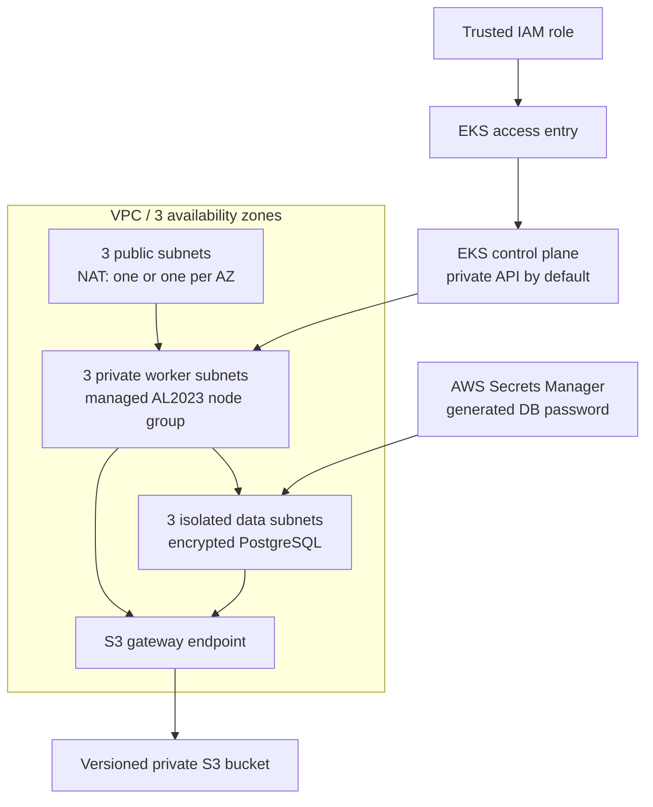

# AWS EKS environment

[](https://github.com/eugene-panin/aws-eks-environment/actions/workflows/terraform.yml)

A compact, production-minded AWS environment implemented with direct Terraform
resources. It is designed to be reviewed as an infrastructure take-home:
network boundaries, EKS access, IAM, data protection, cost trade-offs, and
automated tests are visible in this repository.

The default profile favors a disposable demonstration environment. A separate
HA-oriented profile shows several infrastructure switches used by a long-lived
environment without quietly making the default expensive. It is not presented
as proof that an application is highly available.

## Architecture



The configuration creates:

- one VPC with public, private worker, and isolated data subnets in three AZs;
- an EKS cluster with control-plane logs, API-based access entries, managed
  AL2023 nodes, encrypted gp3 disks, and IMDSv2 enforcement;
- managed VPC CNI, Pod Identity Agent, CoreDNS, and kube-proxy add-ons, with
  compatible versions resolved from the selected Kubernetes version;
- VPC CNI permissions through EKS Pod Identity instead of the EC2 node role;
- private encrypted RDS PostgreSQL with an AWS-managed administrator password;
- a versioned, encrypted S3 bucket with public access blocked and TLS enforced;
- an S3 gateway endpoint for private and data route tables;
- an encrypted S3 backend using native lock files rather than a DynamoDB lock
  table.

## Verify without an AWS account

Terraform's mock provider lets the repository exercise representative
cost-aware and HA-oriented configurations plus two guardrail failures without
credentials or billable resources:

```bash
make check TERRAFORM=terraform
```

The tests assert the security and availability properties rather than snapshot
an entire generated plan:

- the default profile has nine subnets, one NAT gateway, a private EKS API,
  explicit administrator access, encrypted nodes and database, and a private
  versioned bucket;
- the HA-oriented profile has one NAT per AZ, Multi-AZ PostgreSQL, deletion
  protection, a final snapshot, and an explicitly allow-listed public EKS
  endpoint;
- negative cases prove that unrestricted EKS API access and a missing final
  snapshot name are rejected before apply.

CI runs formatting, provider-schema validation, and all mocked cases on every
pull request. The example tfvars files are operator templates; the tests assert
their important properties directly rather than loading placeholder values.

## Plan an environment

Requirements:

- Terraform 1.15 or later;
- AWS credentials with permission to create the declared resources;
- an existing, versioned S3 bucket for Terraform state;
- the expected 12-digit AWS account ID, which prevents accidental cross-account
  apply;
- an IAM role ARN to grant through the EKS access API.

The backend bucket is intentionally separate: creating the bucket in the same
state that depends on it introduces a bootstrap cycle.

```bash
cp backend/dev.hcl.example backend.hcl
cp env/dev.tfvars.example env/dev.tfvars

# Replace placeholders in both local files.
terraform init -backend-config=backend.hcl
terraform plan -var-file=env/dev.tfvars -out=tfplan
terraform apply tfplan
```

Production uses [backend/prod.hcl.example](backend/prod.hcl.example) and a
different state key. Use separate working directories or explicitly
`terraform init -reconfigure`; never point different environments at the same
state.

The EKS endpoint is private-only when
`cluster_endpoint_public_access_cidrs = []`. Its cluster security group allows
HTTPS from the VPC CIDR and any `cluster_private_access_cidrs`. The repository
does not create a VPN, peering link, or bastion, so the operator still needs a
routed path with a source CIDR included by that rule. Public CIDRs broader than
`/8`, including non-canonical forms of `/0`, are rejected.

Use [env/ha.tfvars.example](env/ha.tfvars.example) as a reviewable production
profile, not as universal sizing advice.

## Deliberate trade-offs

| Decision | Default | HA-oriented infrastructure profile |
| --- | --- | --- |
| NAT gateways | One, to limit demo cost | One per AZ to remove a cross-AZ dependency |
| PostgreSQL | Single-AZ `db.t4g.micro` | Multi-AZ and workload-based sizing |
| Database deletion | Final snapshot skipped | Deletion protection and a unique final snapshot |
| EKS API | Private-only | Private, or public only for explicit trusted CIDRs |
| Worker capacity | On-demand | Mix capacity according to interruption tolerance |
| Version changes | Explicit RDS minor; compatible EKS add-ons selected in plan | Review and promote versions through a tested pull request |

EKS, NAT gateways, EC2, and RDS incur charges. Review the plan and current AWS
pricing before applying. The S3 bucket is not force-deleted, and deletion
protection is intentionally capable of blocking teardown.

## Scope and verification

This repository covers the AWS foundation, not an application deployment.
Workload IAM, ingress, autoscaling policy, backup restore drills, and
organization-specific guardrails belong to the workload or landing-zone layer.
For a real multi-tenant cluster, database access should be narrowed from the
single node-group security boundary to a workload boundary such as Security
Groups for Pods or a database proxy.

The compact root state is for reviewability. A real organization should split
state by ownership and lifecycle. Upgrade promotion still needs runtime
validation before production use; schema and mock tests cannot prove an EKS
control-plane, add-on, or PostgreSQL upgrade.

Verified locally with Terraform 1.15.8 and AWS provider 6.56.0:

- `terraform fmt -check -recursive`
- `terraform init -backend=false`
- `terraform validate`
- `terraform test` — two profiles and two negative guardrail cases passed

No live AWS apply is claimed; the automated tests use a mocked provider and do
not prove account quotas, permissions, regional capacity, or runtime behavior.
